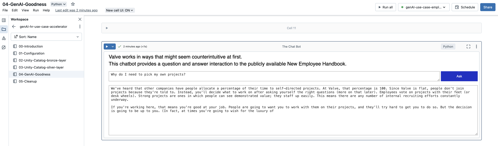

# The Use Case
Generative AI unlocks incredible value from data. The key is starting with a solid business use case to truly realize that value.

This is an actual use case from our HR department. In fact, the exact ask was "Imagine if we flipped our HR inbox/etc. into something similar like a bot…trained it with our handbook, IT policies, benefits, engagement protocol, etc…it would cut down on so many of the asks!"

To demonstrate this use case, this accelerator starts with raw data data in the form of a publicly available employee handbook. We use Valve's New Employee Handbook, which aside from being a fun read, is publicly available with a full path to the [PDF](https://cdn.cloudflare.steamstatic.com/apps/valve/Valve_NewEmployeeHandbook.pdf).

Some of the technical benefits of this accelerator:
- Create a new catalog in Unity Catalog with bronze and silver tables and a managed volume
- Extract and load PDF content into Unity Catalog using AutoLoader
- Leverage Databricks Vector Search to create and store document embeddings
- Leverage Databricks Vector Search and Delta Sync to create and sync a vector index with a Delta table
- Leverage the llama2-70B-Chat model through with Databricks Foundation Model endpoint
- Create a chat bot within a Databricks notebook

## About This Accelerator
This accelerator is self-contained across [five notebooks](./notebooks/). 
1. No third party services are used. Everything, including your data, stays within your Databricks workspace.
2. Although your workspace must attached to a Unity Catalog metastore, this accelerator generates the catalog, schema, tables and volumes for you.
2. This accelerator leverages a managed volume in Unity Catalog. External storage does not have to be defined.
3. No cluster init scripts are used.
4. All code is displayed in the notebooks.

## Databricks Prerequisites
- The workspace must be attached to a Unity Catalog metastore. For help on this, see https://docs.databricks.com/en/data-governance/unity-catalog/get-started.html.
- Serverless compute enabled.
- Personal access tokens must be enabled. For more information on this, see https://docs.databricks.com/en/administration-guide/access-control/tokens.html
- Access to Databricks Foundation Model APIs. For more information on this, see https://docs.databricks.com/en/machine-learning/foundation-models/index.html.

# Before You Get Started
## Medallion Architecture
Although not required, it would be helpful to be familiar with the medallion architecture used in a lakehouse. The layers in the architecture are referred to as bronze, silver, and gold. However, your organization may utilize different terminology. You can learn more about the medallion architecture [here](https://www.databricks.com/glossary/medallion-architecture).

# Recommended Compute
The Databricks workspace used to test this accelerator is in the West US 2 region. 
- Compute policy: `unrestricted`
- Databricks Runtime: `14.3 LTS ML`
- Worker type: `Standard_DS3_v2`
- Min workers: `1`
- Max workers: `2`
- Autoscaling: `yes`
- Photon acceleration: `no`
- Termination period: `10 minutes`

# Optimization
During the course of building out this accelerator, we made heavy use of the [Lakehouse Optimizer (LHO)](https://azuremarketplace.microsoft.com/en/marketplace/apps/blueprint-consulting-services-llc.lakehouse-monitor?tab=overview) to analyze our compute performance and orchestration. 

Early on, based on back-of-napkin estimates, we had configured our compute worker for a minimum of 4 and maximum of 8. However, after evaluating the `CPU Process Load` and `Process Memory Load` KPIs in LHO, we adjusted our compute without a noticeable impact to performance.
